Bellabeat analysis - Case study
================

## How Can a Wellness Technology Company Play It Smart ?

## Introduction

This case study is the final project of the [Google Data Analytics
Professional
Certificate](https://www.coursera.org/professional-certificates/google-data-analytics?utm_source=gg&utm_medium=sem&utm_campaign=15-GoogleDataAnalytics-ROW&utm_content=15-GoogleDataAnalytics-ROW&campaignid=12566515400&adgroupid=117869292685&device=c&keyword=google%20data%20analytics&matchtype=b&network=g&devicemodel=&adpostion=&creativeid=507290840624&hide_mobile_promo&gclid=EAIaIQobChMIv8-GoO2Q9AIVGoBQBh0LvwV5EAAYASAAEgK-qPD_BwE).
In this case study, I will be analyzing a public dataset as if I were a
data analyst working on the marketing team at the health and wellness
company Bellabeat.

#### Bellabeat

Bellabeat is a high-tech company that manufactures health-focused smart
products. Collecting data on activity, sleep, stress, and reproductive
health has allowed Bellabeat to empower women with knowledge about their
health and habits. Since it was founded in 2013, Bellabeat has grown
rapidly and quickly positioned itself as a tech-driven wellness company
for women. By 2016, Bellabeat had opened offices around the world and
launched multiple products. Bellabeat products became available through
a growing number of online retailers in addition to their own e-commerce
channel on their website. The company has invested in traditional
advertising media, such as radio, out-of-home billboards, print, and
television, but focuses on digital marketing extensively.

#### Scenario

You are a junior data analyst working on the marketing analyst team at
Bellabeat, a high-tech manufacturer of health-focused products for
women. Bellabeat is a successful small company, but they have the
potential to become a larger player in the global smart device market.
You have been asked to focus on one of Bellabeat’s products and analyze
smart device data to gain insight into how consumers are using their
smart devices. The insights you discover will then help guide marketing
strategy for the company. You will present your analysis to the
Bellabeat executive team along with your high-level recommendations for
Bellabeat’s marketing strategy.

## Phase 1: Ask

#### Business problem and business task

Analyze smart device usage data in order to gain insight into how
consumers are using their smart devices. The insights will then help
guide the marketing strategy for the company. Additionally, I have to
provide a summary of the analysis with supporting visualizations and
recommendations based on our analysis.

## Phase 2: Prepare

In this phase, we are going to download our data and verify its
credibility and integrity . We are going to check for any licensing,
privacy and security issues, see how the data is organized as well if
there are any other problems with the data.

#### About the Data

The data can be downloaded on
[Kaggle](https://www.kaggle.com/arashnic/fitbit). It is a public domain
dataset made available through
[Mobius](https://www.kaggle.com/arashnic). The data set contains
personal fitness tracker data from thirty Fitbit users. Thirty eligible
Fitbit users consented to the submission of personal tracker data,
including minute-level output for physical activity, heart rate, and
sleep monitoring. It includes information about daily activity, steps,
and heart rate that can be used to explore users’ habits. The data does
not contain any identifiable information.

#### Limitations of the data

-   Most likely, the data isn’t representative of all FitBit users. It
    contains data from only 33 people.
-   The data also has incomplete records, only 24 of the users recorded
    sleep data. And only 8 recorded weight data.
-   The data was collected in 2016 and since smart devices usage and
    features have changed.
-   The data tracks 33 users over 30 days from 4/12/2016 to 5/12/2016
    which is a very short window of time.

Overall, this dataset cannot be considered as reliable data or
representative of smart devices users, and so is not recommended to
produce business recommendations based on this data. But, this is a case
study and for learning purpose I will continue the analysis.

## Phase 3: Process

In this phase I’m going to decide which tools to use, check the data for
errors, transform the data so we can work with it effectively and
document the cleaning process.

#### Choosing the tools

After downloading data sets, We decided to use R for this analysis. With
R I will be able to make the entire analysis process and also make
high-quality visualizations.

#### Installing packages

``` r
#install.packages('tidyverse')
#install.packages('lubridate')
#install.packages('ggplot2')
library(tidyverse)
```

    ## -- Attaching packages --------------------------------------- tidyverse 1.3.1 --

    ## v ggplot2 3.3.5     v purrr   0.3.4
    ## v tibble  3.1.5     v dplyr   1.0.7
    ## v tidyr   1.1.4     v stringr 1.4.0
    ## v readr   2.0.2     v forcats 0.5.1

    ## -- Conflicts ------------------------------------------ tidyverse_conflicts() --
    ## x dplyr::filter() masks stats::filter()
    ## x dplyr::lag()    masks stats::lag()

``` r
library(lubridate)
```

    ## 
    ## Attachement du package : 'lubridate'

    ## Les objets suivants sont masqués depuis 'package:base':
    ## 
    ##     date, intersect, setdiff, union

``` r
library(ggplot2)
```

#### Loading and inspecting the Data

``` r
activity <- read.csv("dailyActivity_merged.csv")
sleep <- read.csv("sleepDay_merged.csv")
```

#### Exploring

In the activity dataset, the column TrackerDistance is already contained
in the TotalDistance column and the column LoggedActivitiesDistance has
no values. Both datasets have a common column Id that I can use for
merging the two datasets. The columns that contain date information have
different names, ActivityData and SleepDay.

``` r
head(activity)
```

    ##           Id ActivityDate TotalSteps TotalDistance TrackerDistance
    ## 1 1503960366    4/12/2016      13162          8.50            8.50
    ## 2 1503960366    4/13/2016      10735          6.97            6.97
    ## 3 1503960366    4/14/2016      10460          6.74            6.74
    ## 4 1503960366    4/15/2016       9762          6.28            6.28
    ## 5 1503960366    4/16/2016      12669          8.16            8.16
    ## 6 1503960366    4/17/2016       9705          6.48            6.48
    ##   LoggedActivitiesDistance VeryActiveDistance ModeratelyActiveDistance
    ## 1                        0               1.88                     0.55
    ## 2                        0               1.57                     0.69
    ## 3                        0               2.44                     0.40
    ## 4                        0               2.14                     1.26
    ## 5                        0               2.71                     0.41
    ## 6                        0               3.19                     0.78
    ##   LightActiveDistance SedentaryActiveDistance VeryActiveMinutes
    ## 1                6.06                       0                25
    ## 2                4.71                       0                21
    ## 3                3.91                       0                30
    ## 4                2.83                       0                29
    ## 5                5.04                       0                36
    ## 6                2.51                       0                38
    ##   FairlyActiveMinutes LightlyActiveMinutes SedentaryMinutes Calories
    ## 1                  13                  328              728     1985
    ## 2                  19                  217              776     1797
    ## 3                  11                  181             1218     1776
    ## 4                  34                  209              726     1745
    ## 5                  10                  221              773     1863
    ## 6                  20                  164              539     1728

``` r
head(sleep)
```

    ##           Id              SleepDay TotalSleepRecords TotalMinutesAsleep
    ## 1 1503960366 4/12/2016 12:00:00 AM                 1                327
    ## 2 1503960366 4/13/2016 12:00:00 AM                 2                384
    ## 3 1503960366 4/15/2016 12:00:00 AM                 1                412
    ## 4 1503960366 4/16/2016 12:00:00 AM                 2                340
    ## 5 1503960366 4/17/2016 12:00:00 AM                 1                700
    ## 6 1503960366 4/19/2016 12:00:00 AM                 1                304
    ##   TotalTimeInBed
    ## 1            346
    ## 2            407
    ## 3            442
    ## 4            367
    ## 5            712
    ## 6            320

``` r
colnames(activity)
```

    ##  [1] "Id"                       "ActivityDate"            
    ##  [3] "TotalSteps"               "TotalDistance"           
    ##  [5] "TrackerDistance"          "LoggedActivitiesDistance"
    ##  [7] "VeryActiveDistance"       "ModeratelyActiveDistance"
    ##  [9] "LightActiveDistance"      "SedentaryActiveDistance" 
    ## [11] "VeryActiveMinutes"        "FairlyActiveMinutes"     
    ## [13] "LightlyActiveMinutes"     "SedentaryMinutes"        
    ## [15] "Calories"

``` r
colnames(sleep)
```

    ## [1] "Id"                 "SleepDay"           "TotalSleepRecords" 
    ## [4] "TotalMinutesAsleep" "TotalTimeInBed"

``` r
str(activity)
```

    ## 'data.frame':    940 obs. of  15 variables:
    ##  $ Id                      : num  1.5e+09 1.5e+09 1.5e+09 1.5e+09 1.5e+09 ...
    ##  $ ActivityDate            : chr  "4/12/2016" "4/13/2016" "4/14/2016" "4/15/2016" ...
    ##  $ TotalSteps              : int  13162 10735 10460 9762 12669 9705 13019 15506 10544 9819 ...
    ##  $ TotalDistance           : num  8.5 6.97 6.74 6.28 8.16 ...
    ##  $ TrackerDistance         : num  8.5 6.97 6.74 6.28 8.16 ...
    ##  $ LoggedActivitiesDistance: num  0 0 0 0 0 0 0 0 0 0 ...
    ##  $ VeryActiveDistance      : num  1.88 1.57 2.44 2.14 2.71 ...
    ##  $ ModeratelyActiveDistance: num  0.55 0.69 0.4 1.26 0.41 ...
    ##  $ LightActiveDistance     : num  6.06 4.71 3.91 2.83 5.04 ...
    ##  $ SedentaryActiveDistance : num  0 0 0 0 0 0 0 0 0 0 ...
    ##  $ VeryActiveMinutes       : int  25 21 30 29 36 38 42 50 28 19 ...
    ##  $ FairlyActiveMinutes     : int  13 19 11 34 10 20 16 31 12 8 ...
    ##  $ LightlyActiveMinutes    : int  328 217 181 209 221 164 233 264 205 211 ...
    ##  $ SedentaryMinutes        : int  728 776 1218 726 773 539 1149 775 818 838 ...
    ##  $ Calories                : int  1985 1797 1776 1745 1863 1728 1921 2035 1786 1775 ...

``` r
str(sleep)
```

    ## 'data.frame':    413 obs. of  5 variables:
    ##  $ Id                : num  1.5e+09 1.5e+09 1.5e+09 1.5e+09 1.5e+09 ...
    ##  $ SleepDay          : chr  "4/12/2016 12:00:00 AM" "4/13/2016 12:00:00 AM" "4/15/2016 12:00:00 AM" "4/16/2016 12:00:00 AM" ...
    ##  $ TotalSleepRecords : int  1 2 1 2 1 1 1 1 1 1 ...
    ##  $ TotalMinutesAsleep: int  327 384 412 340 700 304 360 325 361 430 ...
    ##  $ TotalTimeInBed    : int  346 407 442 367 712 320 377 364 384 449 ...

``` r
nrow(activity)
```

    ## [1] 940

``` r
nrow(sleep)
```

    ## [1] 413

``` r
#Checking the range of the dates
range(activity$ActivityDate)
```

    ## [1] "4/12/2016" "5/9/2016"

``` r
range(sleep$SleepDay)
```

    ## [1] "4/12/2016 12:00:00 AM" "5/9/2016 12:00:00 AM"

#### Checking the number of distinct Id, to see how many respondents are in each dataset

``` r
n_distinct(activity$Id)
```

    ## [1] 33

``` r
n_distinct(sleep$Id)
```

    ## [1] 24

### Data Cleaning and Transformation

#### Changing the format of ActivityDate and SleepDay to ‘Date’

``` r
activity$ActivityDate <- as.Date(activity$ActivityDate, format= "%m/%d/%Y" ) 
sleep$SleepDay <- as.Date(sleep$SleepDay, format= "%m/%d/%Y") #only date in this column


#Checking to see if they are correct
class(activity$ActivityDate)
```

    ## [1] "Date"

``` r
class(sleep$SleepDay)
```

    ## [1] "Date"

#### Removing unnecessary columns from the data frames

``` r
#Removing TrackerDistance and LoggedActivitiesDistance 
activity <- activity %>% 
  select(-"TrackerDistance", -"LoggedActivitiesDistance")
```

#### Renaming the date columns for consistency

``` r
activity <- rename(activity, Date = ActivityDate)
sleep <- rename(sleep, Date = SleepDay)
```

#### Merging the two datasets by Id and Date using a Inner join

With a Inner join, only users that have completed records in both
datasets (sleep and activity) are being merged. So, the new dataset will
not contain ‘NA’ values.

``` r
combined_data <- inner_join(activity, sleep, by = c("Id", "Date"))
n_distinct(combined_data$Id)
```

    ## [1] 24

#### Adding a ‘Time Awake’ column -To know how much time awake users are spending when they go to bed

``` r
combined_data <- combined_data %>% 
  mutate(TimeAwake = TotalTimeInBed - TotalMinutesAsleep)
```

#### Adding ‘Total Active minutes’ column

``` r
combined_data <- combined_data %>% 
  mutate(TotalActiveMinutes = VeryActiveMinutes + FairlyActiveMinutes + LightlyActiveMinutes)
```

#### Adding a ‘day of week’ column

``` r
Sys.setlocale("LC_TIME", "English")
```

    ## [1] "English_United States.1252"

``` r
combined_data$day_of_week <- format(as.Date(combined_data$Date), "%a")

# Ordering the days of week
combined_data$day_of_week <- ordered(combined_data$day_of_week,levels=c("Mon", "Tue", "Wed", "Thu", "Fri", "Sat","Sun"))
```

#### Checking for ‘NA’ and duplicates

``` r
colSums(is.na(combined_data)) 
```

    ##                       Id                     Date               TotalSteps 
    ##                        0                        0                        0 
    ##            TotalDistance       VeryActiveDistance ModeratelyActiveDistance 
    ##                        0                        0                        0 
    ##      LightActiveDistance  SedentaryActiveDistance        VeryActiveMinutes 
    ##                        0                        0                        0 
    ##      FairlyActiveMinutes     LightlyActiveMinutes         SedentaryMinutes 
    ##                        0                        0                        0 
    ##                 Calories        TotalSleepRecords       TotalMinutesAsleep 
    ##                        0                        0                        0 
    ##           TotalTimeInBed                TimeAwake       TotalActiveMinutes 
    ##                        0                        0                        0 
    ##              day_of_week 
    ##                        0

``` r
duplicated(combined_data) %>% 
  table()
```

    ## .
    ## FALSE  TRUE 
    ##   410     3

#### Removing duplicates

``` r
combined_data <- distinct(combined_data)
```

## Phase 4 - Analysis

In this phase, we are going to aggregate our data, perform calculations
and identify trends, and relationships

#### Mean, Median, Minimum and Maximum

``` r
summary(combined_data)
```

    ##        Id                 Date              TotalSteps    TotalDistance   
    ##  Min.   :1.504e+09   Min.   :2016-04-12   Min.   :   17   Min.   : 0.010  
    ##  1st Qu.:3.977e+09   1st Qu.:2016-04-19   1st Qu.: 5189   1st Qu.: 3.592  
    ##  Median :4.703e+09   Median :2016-04-27   Median : 8913   Median : 6.270  
    ##  Mean   :4.995e+09   Mean   :2016-04-26   Mean   : 8515   Mean   : 6.012  
    ##  3rd Qu.:6.962e+09   3rd Qu.:2016-05-04   3rd Qu.:11370   3rd Qu.: 8.005  
    ##  Max.   :8.792e+09   Max.   :2016-05-12   Max.   :22770   Max.   :17.540  
    ##                                                                           
    ##  VeryActiveDistance ModeratelyActiveDistance LightActiveDistance
    ##  Min.   : 0.000     Min.   :0.0000           Min.   :0.010      
    ##  1st Qu.: 0.000     1st Qu.:0.0000           1st Qu.:2.540      
    ##  Median : 0.570     Median :0.4200           Median :3.665      
    ##  Mean   : 1.446     Mean   :0.7439           Mean   :3.791      
    ##  3rd Qu.: 2.360     3rd Qu.:1.0375           3rd Qu.:4.918      
    ##  Max.   :12.540     Max.   :6.4800           Max.   :9.480      
    ##                                                                 
    ##  SedentaryActiveDistance VeryActiveMinutes FairlyActiveMinutes
    ##  Min.   :0.0000000       Min.   :  0.00    Min.   :  0.00     
    ##  1st Qu.:0.0000000       1st Qu.:  0.00    1st Qu.:  0.00     
    ##  Median :0.0000000       Median :  9.00    Median : 11.00     
    ##  Mean   :0.0009268       Mean   : 25.05    Mean   : 17.92     
    ##  3rd Qu.:0.0000000       3rd Qu.: 38.00    3rd Qu.: 26.75     
    ##  Max.   :0.1100000       Max.   :210.00    Max.   :143.00     
    ##                                                               
    ##  LightlyActiveMinutes SedentaryMinutes    Calories    TotalSleepRecords
    ##  Min.   :  2.0        Min.   :   0.0   Min.   : 257   Min.   :1.00     
    ##  1st Qu.:158.0        1st Qu.: 631.2   1st Qu.:1841   1st Qu.:1.00     
    ##  Median :208.0        Median : 717.0   Median :2207   Median :1.00     
    ##  Mean   :216.5        Mean   : 712.1   Mean   :2389   Mean   :1.12     
    ##  3rd Qu.:263.0        3rd Qu.: 782.8   3rd Qu.:2920   3rd Qu.:1.00     
    ##  Max.   :518.0        Max.   :1265.0   Max.   :4900   Max.   :3.00     
    ##                                                                        
    ##  TotalMinutesAsleep TotalTimeInBed    TimeAwake      TotalActiveMinutes
    ##  Min.   : 58.0      Min.   : 61.0   Min.   :  0.00   Min.   :  2.0     
    ##  1st Qu.:361.0      1st Qu.:403.8   1st Qu.: 17.00   1st Qu.:206.5     
    ##  Median :432.5      Median :463.0   Median : 25.50   Median :263.5     
    ##  Mean   :419.2      Mean   :458.5   Mean   : 39.31   Mean   :259.5     
    ##  3rd Qu.:490.0      3rd Qu.:526.0   3rd Qu.: 40.00   3rd Qu.:315.5     
    ##  Max.   :796.0      Max.   :961.0   Max.   :371.00   Max.   :540.0     
    ##                                                                        
    ##  day_of_week
    ##  Mon:46     
    ##  Tue:65     
    ##  Wed:66     
    ##  Thu:64     
    ##  Fri:57     
    ##  Sat:57     
    ##  Sun:55

#### Average number of steps by they of week

``` r
combined_data %>%
  select(TotalSteps, day_of_week)%>%
  group_by(day_of_week)%>%
  summarise(TotalSteps= round(c(TotalSteps= mean(TotalSteps)),0))
```

    ## # A tibble: 7 x 2
    ##   day_of_week TotalSteps
    ##   <ord>            <dbl>
    ## 1 Mon               9273
    ## 2 Tue               9183
    ## 3 Wed               8023
    ## 4 Thu               8184
    ## 5 Fri               7901
    ## 6 Sat               9871
    ## 7 Sun               7298

#### Average distance by day of week

``` r
combined_data %>%
  select(TotalDistance, day_of_week)%>%
  group_by(day_of_week)%>%
  summarise(TotalDistance= round(c(TotalDistance= mean(TotalDistance)),2))
```

    ## # A tibble: 7 x 2
    ##   day_of_week TotalDistance
    ##   <ord>               <dbl>
    ## 1 Mon                  6.54
    ## 2 Tue                  6.43
    ## 3 Wed                  5.72
    ## 4 Thu                  5.77
    ## 5 Fri                  5.51
    ## 6 Sat                  7.02
    ## 7 Sun                  5.18

#### Average hours of sleep by day of week

``` r
combined_data %>%
  select(TotalMinutesAsleep, day_of_week)%>%
  group_by(day_of_week)%>%
  summarise(TotalMinutesAsleep= round(c(mean(TotalMinutesAsleep)/60),2))
```

    ## # A tibble: 7 x 2
    ##   day_of_week TotalMinutesAsleep
    ##   <ord>                    <dbl>
    ## 1 Mon                       6.99
    ## 2 Tue                       6.74
    ## 3 Wed                       7.24
    ## 4 Thu                       6.69
    ## 5 Fri                       6.76
    ## 6 Sat                       6.98
    ## 7 Sun                       7.55

#### Average minutes of activity by intensity

``` r
combined_data %>%
  summarise(intensity= ordered(c("Very Active", "Fairly Active", "Lightly Active", "Sedentary Time"), levels=c("Very Active", "Fairly Active", "Lightly Active", "Sedentary Time")),
            avg_minutes = round(c(VeryActiveMinutes= mean(VeryActiveMinutes), FairlyActiveMinutes= mean(FairlyActiveMinutes),
                            LightlyActiveMinutes= mean(LightlyActiveMinutes), 
                            SedentaryMinutes= mean(SedentaryMinutes)),0))
```

    ##        intensity avg_minutes
    ## 1    Very Active          25
    ## 2  Fairly Active          18
    ## 3 Lightly Active         217
    ## 4 Sedentary Time         712

#### Average calories burnt by day of week

``` r
combined_data %>%
  select(Calories, day_of_week)%>%
  group_by(day_of_week)%>%
  summarise(Calories= round(c(mean(Calories)),0))
```

    ## # A tibble: 7 x 2
    ##   day_of_week Calories
    ##   <ord>          <dbl>
    ## 1 Mon             2432
    ## 2 Tue             2496
    ## 3 Wed             2378
    ## 4 Thu             2307
    ## 5 Fri             2330
    ## 6 Sat             2507
    ## 7 Sun             2277

#### How many participant are having a good night of sleep (between 7 and 9 hours)

The
[SleepFoundation](https://www.sleepfoundation.org/how-sleep-works/how-much-sleep-do-we-really-need)
advise that healthy adults need between 7 and 9 hours of sleep per
night.

``` r
# Sleep between 7 and 9 hours
combined_data %>%
  select(Id, TotalMinutesAsleep) %>%
  group_by(Id) %>%
  summarise(mean_sleep = mean(TotalMinutesAsleep))%>%
  filter(mean_sleep >= 420 & mean_sleep<=540) 
```

    ## # A tibble: 10 x 2
    ##            Id mean_sleep
    ##         <dbl>      <dbl>
    ##  1 2026352035       506.
    ##  2 2347167796       447.
    ##  3 4319703577       477.
    ##  4 5553957443       463.
    ##  5 5577150313       432 
    ##  6 6117666160       479.
    ##  7 6962181067       448 
    ##  8 7086361926       453.
    ##  9 8378563200       445.
    ## 10 8792009665       436.

#### How many users are walking more than 10k steps.

10k is the default goal set for each
[FitBit](https://blog.fitbit.com/the-magic-of-10000-steps/) member.

``` r
# Participant that Total steps is more than 10k
combined_data %>%
  select(Id, TotalSteps) %>%
  group_by(Id) %>%
  summarise(meansteps = mean(TotalSteps))%>%
  filter(meansteps >= 10000) 
```

    ## # A tibble: 5 x 2
    ##           Id meansteps
    ##        <dbl>     <dbl>
    ## 1 1503960366    12406.
    ## 2 3977333714    11218 
    ## 3 4388161847    11034.
    ## 4 7086361926    10290.
    ## 5 8053475328    19079.

#### Relation between Minutes awake in bed and Total Steps

``` r
#Participant that walk more than 10k in average - 4 out 5 have less than 30 minutes awake
combined_data %>%
  select(TimeAwake, TotalSteps, Id) %>%
  group_by(Id) %>%
  summarise(meansteps = mean(TotalSteps), timeawake= round(c(mean(TimeAwake)),0))%>%
  filter(meansteps>=10000)
```

    ## # A tibble: 5 x 3
    ##           Id meansteps timeawake
    ##        <dbl>     <dbl>     <dbl>
    ## 1 1503960366    12406.        23
    ## 2 3977333714    11218        168
    ## 3 4388161847    11034.        23
    ## 4 7086361926    10290.        13
    ## 5 8053475328    19079.         5

``` r
#Users that walk less than 10k in average - 8 out of 19 have more than 30 minutes awake
combined_data %>%
  select(TimeAwake, TotalSteps, Id) %>%
  group_by(Id) %>%
  summarise(meansteps = mean(TotalSteps), timeawake= round(c(mean(TimeAwake)),0))%>%
  filter(meansteps<=10000)
```

    ## # A tibble: 19 x 3
    ##            Id meansteps timeawake
    ##         <dbl>     <dbl>     <dbl>
    ##  1 1644430081     7968.        52
    ##  2 1844505072     3477        309
    ##  3 1927972279     1490         21
    ##  4 2026352035     5619.        31
    ##  5 2320127002     5079          8
    ##  6 2347167796     8533.        45
    ##  7 4020332650     6597.        30
    ##  8 4319703577     7125.        25
    ##  9 4445114986     4756.        32
    ## 10 4558609924     8139         12
    ## 11 4702921684     9036.        21
    ## 12 5553957443     8613.        42
    ## 13 5577150313     9260.        29
    ## 14 6117666160     8824.        31
    ## 15 6775888955     3499         19
    ## 16 6962181067     9795.        18
    ## 17 7007744171     5116.         3
    ## 18 8378563200     8718.        41
    ## 19 8792009665     3443.        18

#### Relation between total hours sleep and Total Steps taken (more 10K & less 10K steps)

``` r
#Average hours of sleep of Users that walk more than 10K steps - 6.6 hours
combined_data %>%
  select(TotalMinutesAsleep, TotalSteps) %>%
  filter(TotalSteps >=10000) %>%
  summarise(mean_step = mean(TotalSteps), 
            mean_sleep= round(c(mean_sleep= mean(TotalMinutesAsleep/60)),2))
```

    ##   mean_step mean_sleep
    ## 1  12526.38        6.6

``` r
#Average hours of sleep of Users that walk less than 10K steps - 7.25 hours  
combined_data %>%
  select(TotalMinutesAsleep, TotalSteps) %>%
  filter(TotalSteps <10000) %>%
  summarise(mean_step = mean(TotalSteps), 
            mean_sleep= round(c(mean_sleep= mean(TotalMinutesAsleep/60)),2))
```

    ##   mean_step mean_sleep
    ## 1   5813.31       7.25

## Phase 5 - Share : Visualizations

#### Average steps by day of week

``` r
combined_data %>%
  select(TotalSteps, day_of_week)%>%
  group_by(day_of_week)%>%
  summarise(TotalSteps= round(c(TotalSteps= mean(TotalSteps)),0))%>%
  ggplot(aes(x=day_of_week, y=TotalSteps, fill=TotalSteps)) + geom_bar(stat='identity') +
  labs(title = "Average steps by day of week", subtitle="",
       x="", y="Average steps", fill="Average Steps") +
  geom_hline(yintercept=10000, linetype="dashed", color = "red")+
  geom_text(aes(x=day_of_week, y= TotalSteps, label = TotalSteps), 
            vjust = -0.5, size = 2)+
  annotate("text", x='Thu', y=10400, label= "10k steps", size= 2, color="red")
```

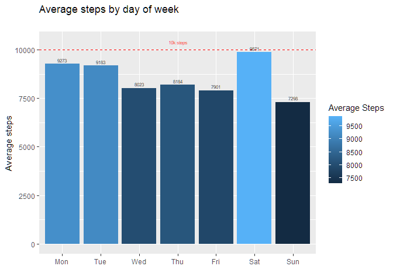<!-- -->

#### Total Distance by day of the week

``` r
combined_data %>%
  select(TotalDistance, day_of_week)%>%
  group_by(day_of_week)%>%
  summarise(TotalDistance= round(c(TotalDistance= mean(TotalDistance)),2))%>%
  ggplot(aes(x=day_of_week, y=TotalDistance, fill=TotalDistance)) + geom_bar(stat='identity')+
  labs(title = "Average distance(km) by day of week", subtitle="",
       x="", y="Average distance(km)", fill="Average distance") +
  geom_text(aes(x=day_of_week, y= TotalDistance, label = TotalDistance), 
            vjust = -0.5, size = 2)
```

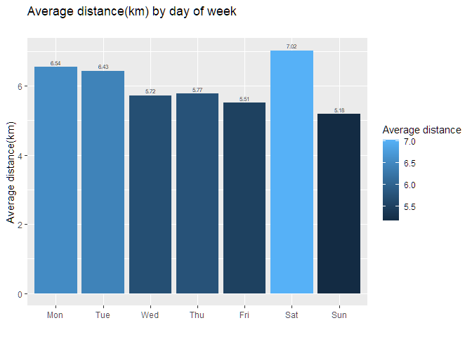<!-- -->

#### Average hours of sleep by day of the week

``` r
combined_data %>%
  select(TotalMinutesAsleep, day_of_week)%>%
  group_by(day_of_week)%>%
  summarise(TotalMinutesAsleep= round(c(mean(TotalMinutesAsleep)/60),2)) %>%
  ggplot(aes(x=day_of_week, y=TotalMinutesAsleep, fill=TotalMinutesAsleep)) + geom_bar(stat='identity')+
  labs(title = "Average hours of sleep by day of week", subtitle="",
       x="", y="Average sleep", fill="Average Sleep")  +
  geom_hline(yintercept=7, linetype="dashed", color = "red") +
  geom_text(aes(x=day_of_week, y= TotalMinutesAsleep, label = TotalMinutesAsleep), 
            vjust = -0.5, size = 2) +
  annotate("text", x='Sun', y=7.2, label= "7 hours", size= 2, color="red")
```

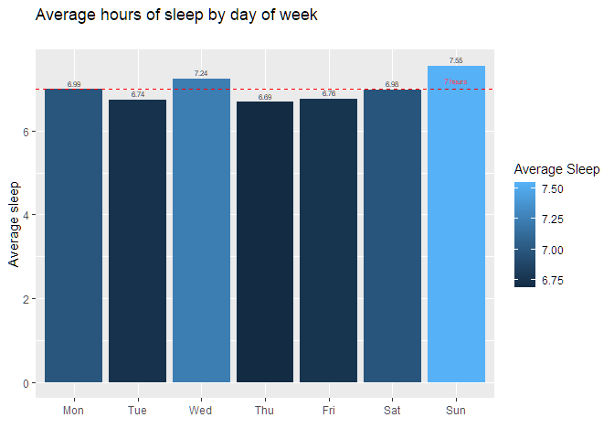<!-- -->

#### Average Calories burned by day of the week

``` r
combined_data %>%
  select(Calories, day_of_week)%>%
  group_by(day_of_week)%>%
  summarise(Calories= round(c(mean(Calories)),0)) %>%
  ggplot(aes(x=day_of_week, y= Calories, fill= Calories)) + geom_bar(stat='identity')+
  labs(title = "Average Calories burned by day of week", subtitle="",
       x="", y="Calories", fill="Calories")  +
  geom_text(aes(x= day_of_week, y= Calories, label = Calories), 
            vjust = -0.5, size = 2)
```

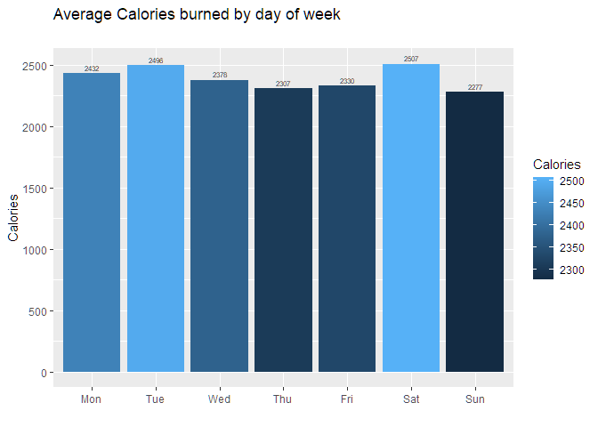<!-- -->

#### Average minutes of activity by intensity

``` r
combined_data %>%
  summarise(intensity= ordered(c("Very Active", "Fairly Active", "Lightly Active", "Sedentary Time"), levels=c("Very Active", "Fairly Active", "Lightly Active", "Sedentary Time")),
            avg_minutes = round(c(VeryActiveMinutes= mean(VeryActiveMinutes), FairlyActiveMinutes= mean(FairlyActiveMinutes),
                            LightlyActiveMinutes= mean(LightlyActiveMinutes), 
                            SedentaryMinutes= mean(SedentaryMinutes)),0))%>%
  ggplot(aes(x= intensity, y= avg_minutes, fill= intensity)) +
  geom_bar(position = "dodge", stat='identity') +
  geom_text(aes(x=intensity, y= avg_minutes, label = avg_minutes), 
            vjust = -0.5, size = 2)+
  labs(title = "Average minutes of activity by intensity", subtitle="",
       x="", y="Average Minutes", fill="Activity Intensity")+
  scale_fill_manual(values=c("dodgerblue4", "dodgerblue", "skyblue3", "skyblue"))
```

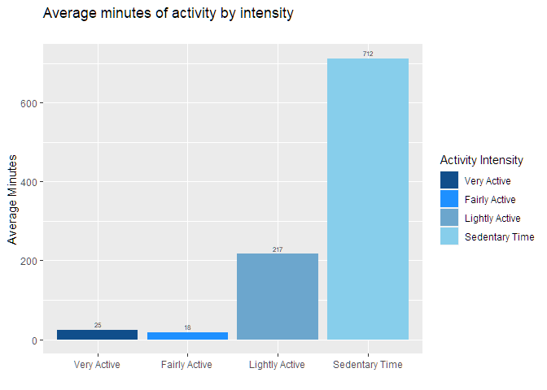<!-- -->

#### Calories burned vc. Total Steps

``` r
combined_data %>%
  select(TotalSteps, Calories)%>%
  ggplot(aes(x=TotalSteps, y=Calories, color= Calories)) + geom_point(alpha=0.7) +
  labs(title = "Calories burned vs. Total steps", subtitle="",
       x="Total steps", y="Calories", color="Calories")  +
  geom_vline(xintercept=10000, linetype="dashed", color = "red") +
  annotate("text", x=9500, y=4500, label= "10k steps", size= 2, color="red", angle = 90)
```

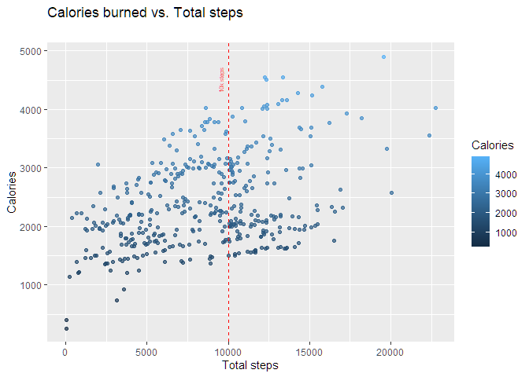<!-- -->

#### Total Hours of sleep vc. Total steps

``` r
combined_data %>%
  select(TotalMinutesAsleep, TotalSteps)%>%
  summarise(TotalMinutesAsleep= round(c(TotalMinutesAsleep= TotalMinutesAsleep/60),2), TotalSteps=TotalSteps) %>%
  ggplot(aes(x=TotalSteps, y=TotalMinutesAsleep, color= TotalMinutesAsleep)) + geom_point(alpha=0.7) +
 labs(title = "Total hours of sleep vs. Total steps", subtitle="",
       y="Total hours of sleep", x="Total steps", color="Total Sleep")  +
  geom_hline(yintercept=7, linetype="dashed", color = "red") +
  geom_vline(xintercept=10000, linetype="dashed", color = "red") +
  annotate("text", x=20000, y=7.3, label= "7 hours", size= 2, color="red") +
  annotate("text", x=9000, y=13, label= "10K steps", size= 2, color="red", angle = 90)
```

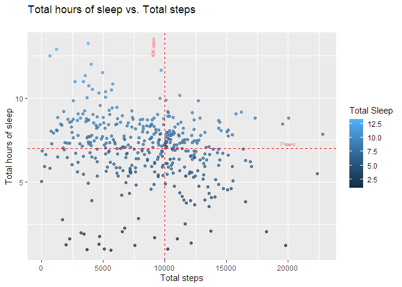<!-- -->

#### Total minutes awake in bed vs. Total Steps

``` r
combined_data %>%
  select(TimeAwake, TotalSteps)%>%
  ggplot(aes(y=TimeAwake, x=TotalSteps, color= TimeAwake)) + geom_point(alpha=0.5) +
  labs(title = "Mintutes to fall sleep vs Total steps", subtitle="",
       x="Total steps", y="Minutes awake", color="Minutes awake")  +
  geom_hline(yintercept=30, linetype="dashed", color = "red") +
  geom_vline(xintercept=10000, linetype="dashed", color = "red") +
  ylim(0, 200) +
  annotate("text", x=20000, y=35, label= "30 minutes", size= 2, color="red") +
  annotate("text", x=9000, y=100, label= "10K steps", size= 2, color="red", angle = 90)
```

    ## Warning: Removed 9 rows containing missing values (geom_point).

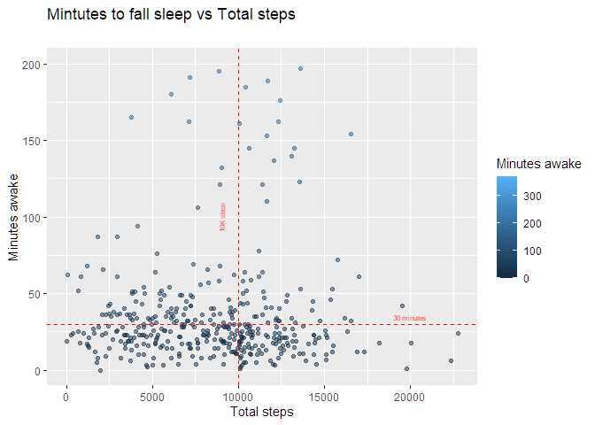<!-- -->

#### Relation between Total minutes awake in bed and Total sedentary minutes

``` r
combined_data %>%
  select(TimeAwake, SedentaryMinutes)%>%
  ggplot(aes(y=TimeAwake, x=SedentaryMinutes, color= TimeAwake)) + geom_point(alpha=0.5) +
  labs(title = "Mintutes to fall sleep vs Total sedentary minutes", subtitle="",
       x="Sedentary minutes", y="Minutes awake", color ="Minutes awake")  +
  geom_hline(yintercept=30, linetype="dashed", color = "red") +
  ylim(0, 200) +
  annotate("text", x=1100, y=35, label= "30 minutes", size= 2, color="red")  
```

    ## Warning: Removed 9 rows containing missing values (geom_point).

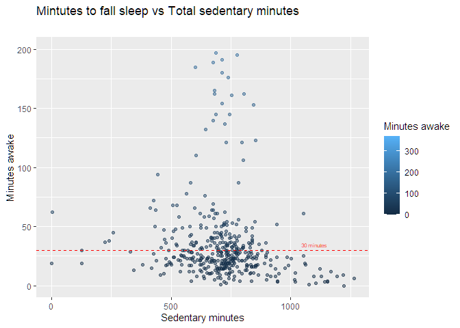<!-- -->

#### Relation between hours of sleep and Total minutes of activity

``` r
combined_data %>%
  select(TotalMinutesAsleep, TotalActiveMinutes)%>%
  summarise(TotalMinutesAsleep= round(c(TotalMinutesAsleep= TotalMinutesAsleep/60),2), TotalActiveMinutes=TotalActiveMinutes) %>%
  ggplot(aes(x=TotalActiveMinutes,y=TotalMinutesAsleep, color= TotalMinutesAsleep)) + geom_point(alpha=0.5) +
  labs(title = "Total hours of sleep vs. Total minutes activity", subtitle="",
       x="Total minutes of activity", y="Total sleep", color="Sleep")  +
  geom_hline(yintercept=7, linetype="dashed", color = "red") +
  annotate("text", x=460, y=7.3, label= "7 hours", size= 2, color="red") 
```

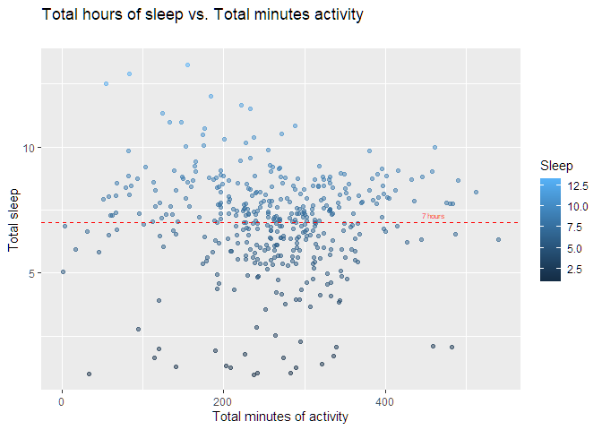<!-- -->

#### Relation between hours of sleep and Total sedantary minutes

``` r
combined_data %>%
  select(TotalMinutesAsleep, SedentaryMinutes)%>%
  summarise(TotalMinutesAsleep= round(c(TotalMinutesAsleep= TotalMinutesAsleep/60),2), SedentaryMinutes=SedentaryMinutes) %>%
  ggplot(aes(x=SedentaryMinutes,y=TotalMinutesAsleep, color= TotalMinutesAsleep)) + geom_point(alpha=0.3) +
  labs(title = "Total hours of sleep vs. Sedentary minutes", subtitle="",
       x="Total sedentary minutes", y="Total sleep", fill="Sleep")  +
  geom_hline(yintercept=7, linetype="dashed", color = "red") +
  xlim(250, 1250) +
  annotate("text", x=1200, y=7.3, label= "7 hours", size= 2, color="red") 
```

    ## Warning: Removed 8 rows containing missing values (geom_point).

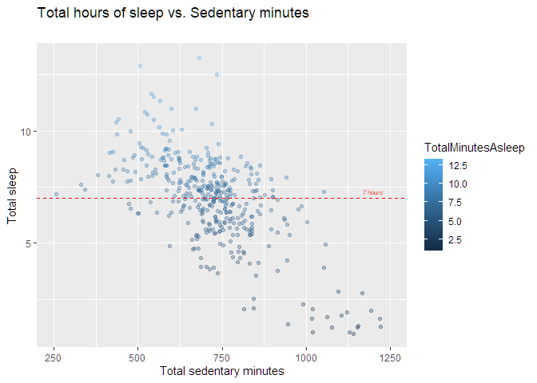<!-- -->

## Act

### Findings

#### Sleep:

According to the \[Sleep
Foundation\](<https://www.sleepfoundation.org/how-sleep-works/how-much-sleep-do-we-really-need>
adults should have between 7 to 9 hours of sleep per night. \* The
analysis shows that 10 users (out of 24) are having a good night sleep
between 7 and 9 hours. \* Users are sleeping more on Sundays, 7.5 hours
on average

#### Activity/Steps:

-   Users spent most of their time in a Sedentary state, on average 712
    minutes(12 hours). Next to Sedentary, the 2nd most common activity
    type is Lightly Active with 217 minutes (4 hours).
-   Only 5 users out of 24 are walking more than 10K steps a day. And
    the average number of steps that people walk is 8515 steps.
-   Saturday is the day of the week with the higher number of steps 9871
    steps on average, not coincidentally it is also the day of the week
    with the higher distance 7.02km and the higher calories burned 2507
    calories.

#### Relations between the data

-   4 out of the 5 users that walk more than 10K steps on average have
    less than 30 minutes awake on average before falling sleep
-   8 out of the 19 users that walk less than 10K steps on average have
    more than 30 minutes awake on average before falling sleep
-   Interestingly, users that walk more than 10K steps are having less
    sleep hours than users that walk less than 10K steps. On average 6.6
    and 7.25 hours.

#### What are the trends identified?

-   Only 21% of users are meeting the default goal of 10K steps.
-   Bellabeat marketing team can set up notifications that remind users
    to exercise.
-   Create challenges between Bellabeat users to encourage users to stay
    active and make full use of their device.
-   Some users did not record their sleep. It is possible that these
    users found it uncomfortable to wear them to sleep, or the device
    had a malfunction. A survey can help investigate further the reasons
    why these users didn’t record their sleep.
-   Only 8 users recorded their weight. It is possible that this
    happened because users have to input manually this information. I
    would recommend adding a new feature that connects the App to a
    smart scale.
-   The data collected from their devices could be used to provide
    personalized suggestions of how to improve their fitness
    performances.
